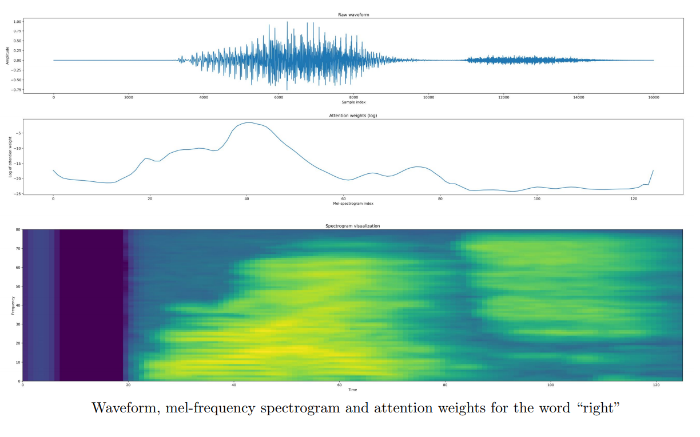

# Speech Command Recognition

## A Keras implementation of neural attention model for speech command recognition

This repository presents a recurrent attention model designed to identify keywords in short segments of audio. It has been tested using the Google Speech Command Datasets (v1 and v2).
For a complete description of the architecture, please refer to [our paper](https://arxiv.org/abs/1808.08929).

Our main contributions are:

- A small footprint model (201K trainable parameters) that outperforms convolutional architectures for speech command recognition (AKA keyword spotting);
- A SpeechGenerator.py script that enables loading WAV files saved in .npy format from disk (like a Keras image generator, but for audio files);
- Attention outputs that make the model explainable (i.e., it is possible to identify what part of the audio was important to reach a conclusion).

# Attention Model

One usual problem with deep learning models is that they are usually "black-box" in the sense that it is very difficult to explain why the model reaches a certain decision. Attention is a powerful tool to make deep neural network models explainable: the picture below demonstrates that the transition from phoneme /a/ to phoneme /i/ is the most relevant part of the audio that the model used to decide (correctly) that the word is "right". Please refer to  [our paper](https://arxiv.org/abs/1808.08929) for confusion matrix and more attention plots.



# How to use this code

The Demo notebook is preconfigured with a set of tasks: ```['12cmd', 'leftright', '35word', '20cmd']```. Each of these refer to how many commands should be recognized by the model. When loading the Google Speech Dataset, the user should also select which version to download and use by adjusting the following line:

```gscInfo, nCategs = SpeechDownloader.PrepareGoogleSpeechCmd(version=1, task = '35word')```

## Cloning this repository

- Download or clone this repository;
- Open the Demo notebook;
- Choose how many words should be recognized and the Google Speech Dataset version to use;
- Run training and tests.

## Using Google Colab

Google Colaboratory is an amazing tool for experimentation using a Jupyter Notebook environment with GPUs.

- Open Colab: https://colab.research.google.com/ ;
- Download and upload the notebood Speech_Recog_Demo.ipynb to Colab, then open it;
- Enable GPU acceleration in menu Edit -> Notebook settings;
- Set useColab = True;
- Choose how many words should be recognized and the Google Speech Dataset version to use;
- Run training and tests.

## Train with your own data

If you want to train with your own data:

- Use the ```audioUtily.py WAV2Numpy``` function to save your WAV files in numpy format. This speeds up loading considerably;
- Create a ```list_IDs``` array containing the paths to all the numpy files and a ```labels``` array with corresponding labels (already converted to integers);
- Instantiate a ```SpeechGenerator.py SpeechGen``` class;
- Create your own Keras model for audio classification or use one provided in ```SpeechModels.py```;
- Train the model.

# Final Words

We would like to thank Google for making such a great speech dataset available for public use and for making Colab available.

If you find this code useful, please cite our work:

```
@ARTICLE{2018arXiv180808929C,
   author = {{Coimbra de Andrade}, D. and {Leo}, S. and {Loesener Da Silva Viana}, M. and 
	{Bernkopf}, C.},
    title = "{A neural attention model for speech command recognition}",
  journal = {ArXiv e-prints},
archivePrefix = "arXiv",
   eprint = {1808.08929},
 keywords = {Electrical Engineering and Systems Science - Audio and Speech Processing, Computer Science - Sound},
     year = 2018,
    month = aug,
   adsurl = {http://adsabs.harvard.edu/abs/2018arXiv180808929C},
  adsnote = {Provided by the SAO/NASA Astrophysics Data System}
}
```
